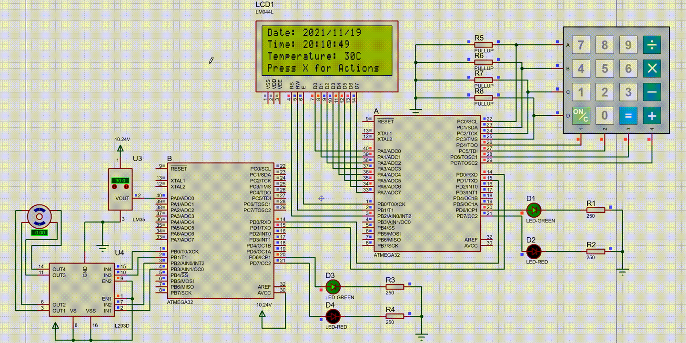
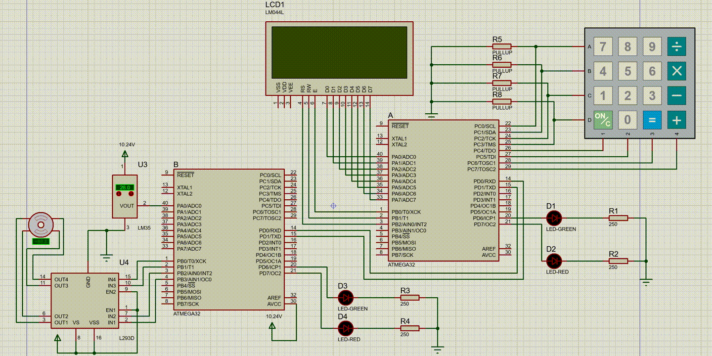
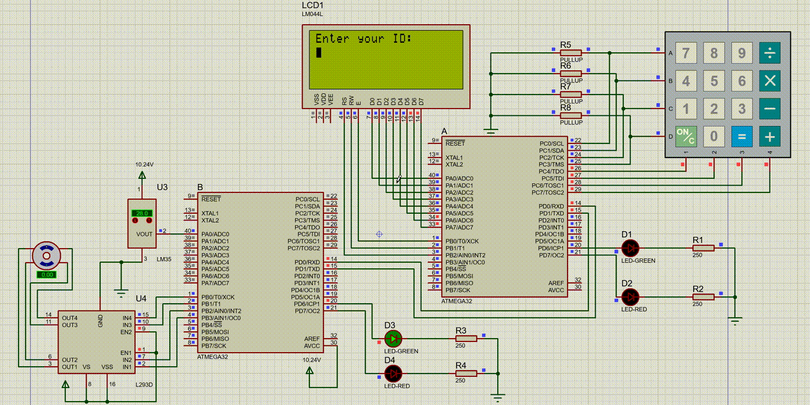

# Serial Communication

    The main goal in this project is connecting two AVR ATmega32 with USART for transfering data.

# Usage
    Here you can find how to interact with the system.
## 1. Stepper Motor

## 2. Temperature

## 3. Date & Time

## 4. User Management
- ### Login/Logout

- ### Add User

- ### Edit User

- ### Remove User
    The memory of ATmega32 can hold up to 35 users but here for showing the error we reduced the limit to 2 users.
    

